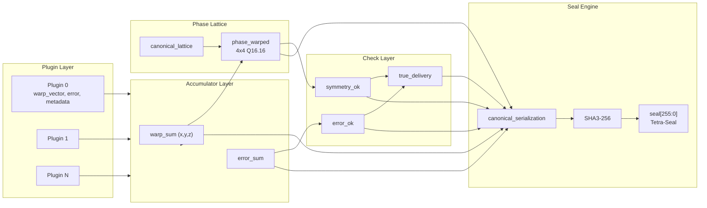
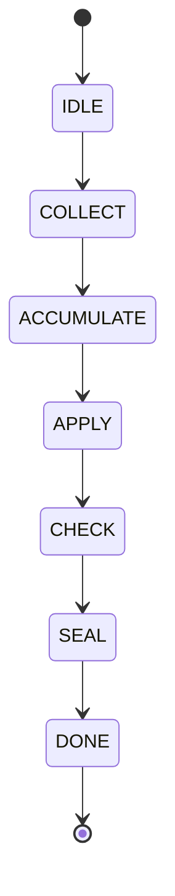

Here’s a clean **`docs/architecture_diagram.md`** using Mermaid that matches the architecture doc you just locked in.

---

# **ISO‑16 Architecture Diagram**
### High‑Level Component and Data Flow Overview  
*(Informative)*

The following Mermaid diagram illustrates the core ISO‑16 components, their relationships, and the execution flow from plugins through the True Delivery Loop to the Tetra‑Seal.

---

## **State Machine Overview**

These diagrams correspond directly to the components and flow described in `architecture.md`, `true_delivery_loop.md`, and the waveform documentation.